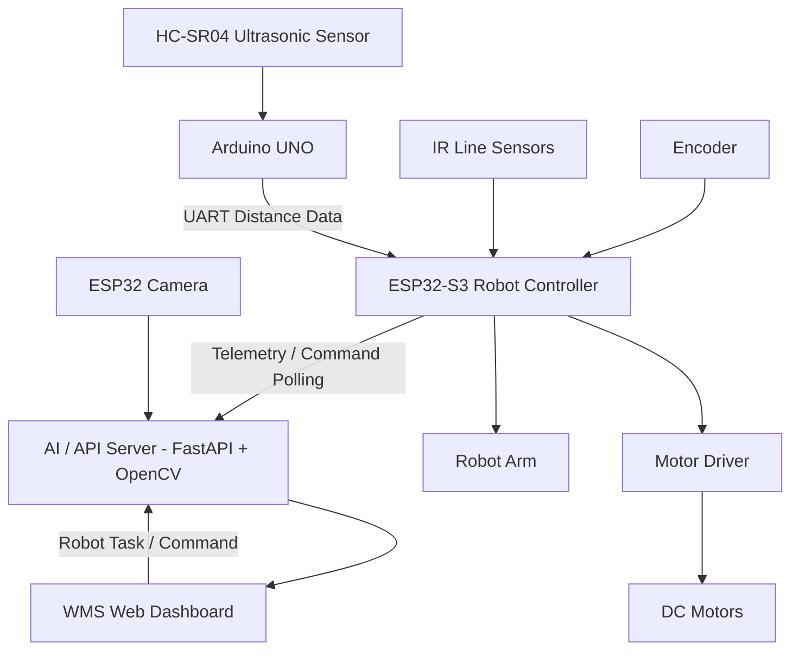

# Robot Line - WMS Autonomous Robot System

Project mô phỏng và triển khai hệ thống robot line trong kho thông minh. Hệ thống gồm robot bám line sử dụng ESP32-S3, Arduino UNO đọc cảm biến siêu âm, cánh tay robot để gắp/thả hàng hóa, web dashboard WMS để giám sát và điều phối robot, cùng AI/API server để xử lý camera, telemetry và tác vụ robot.

Robot có khả năng di chuyển theo line, xử lý line đứt đoạn, né tránh vật cản và tự tìm lại line sau khi hoàn thành quá trình tránh vật cản. AI server hỗ trợ xử lý hình ảnh từ camera để nhận diện vật cản, người và hàng hóa trong môi trường kho.

## Tổng Quan Hệ Thống

| Thành phần                    | Thư mục          | Vai trò                                                                                                   |
| ----------------------------- | ---------------- | --------------------------------------------------------------------------------------------------------- |
| ESP32-S3 Robot Controller     | `ESP/`           | Điều khiển robot bám line, motor, encoder, IR sensor, camera, Wi-Fi, gửi telemetry và nhận lệnh từ server |
| Arduino UNO Ultrasonic Module | `UNO/`           | Đọc cảm biến siêu âm HC-SR04 và gửi khoảng cách sang ESP32-S3 qua UART                                    |
| Robot Arm Module              | `ESP/`           | Điều khiển cánh tay robot để gắp và thả hàng hóa tại vị trí được chỉ định                                 |
| WMS Web Dashboard             | `web/`           | Giao diện quản lý kho, robot, bản đồ, task, cảnh báo, camera và telemetry                                 |
| AI / API Server               | `web/ai-server/` | FastAPI server nhận frame camera, xử lý vision, quản lý robot command, telemetry và dữ liệu WMS           |

## Tính Năng Chính

* Robot bám line tự động trong môi trường kho.
* Có khả năng đi qua các đoạn line bị đứt hoặc không liên tục.
* Phát hiện và né tránh vật cản trong quá trình di chuyển.
* Tự tìm lại line sau khi hoàn thành quá trình tránh vật cản.
* Cánh tay robot hỗ trợ gắp và thả hàng hóa.
* AI server xử lý hình ảnh từ camera để nhận diện vật cản, người và hàng hóa.
* Web dashboard WMS hỗ trợ theo dõi robot, task, inventory, cảnh báo, camera và telemetry.
* ESP32-S3 gửi telemetry và nhận lệnh điều phối từ server thông qua API.

## Sơ Đồ Hoạt Động Tổng Quan



## Cấu Trúc Thư Mục

```text
robot line/
├── ESP/
│   ├── platformio.ini
│   └── src/main.cpp
├── UNO/
│   ├── platformio.ini
│   └── src/main.cpp
├── web/
│   ├── src/
│   ├── public/
│   ├── ai-server/
│   ├── package.json
│   └── README.md
└── README.md
```

## Công Nghệ Sử Dụng

### Firmware

* PlatformIO
* Arduino Framework
* ESP32-S3 DevKitC-1
* Arduino UNO
* ESP32 Camera
* ArduinoJson
* Wi-Fi HTTP Client
* IR Line Sensors
* Encoder
* HC-SR04 Ultrasonic Sensor
* Motor Driver
* Robot Arm / Servo Motor

### Web Dashboard

* React
* TypeScript
* Vite
* React Router
* Recharts
* Tailwind CSS
* Lucide React

### AI / API Server

* Python
* FastAPI
* Uvicorn
* OpenCV
* NumPy
* Ultralytics
* WebSocket / HTTP API

## Luồng Hoạt Động

1. Arduino UNO đọc khoảng cách từ cảm biến siêu âm HC-SR04.
2. UNO gửi dữ liệu khoảng cách sang ESP32-S3 qua UART.
3. ESP32-S3 điều khiển robot bám line bằng cảm biến IR, motor và encoder.
4. Khi gặp vật cản, robot thực hiện né tránh và tìm lại line để tiếp tục di chuyển.
5. Robot có thể xử lý trường hợp line bị đứt đoạn bằng cách tiếp tục dò và quay lại đường line.
6. Cánh tay robot thực hiện thao tác gắp và thả hàng hóa theo tác vụ được điều phối.
7. ESP32-S3 gửi telemetry lên AI/API server.
8. ESP32-S3 lấy lệnh điều phối từ server thông qua API.
9. Camera gửi frame về AI server để xử lý hình ảnh.
10. Web dashboard hiển thị trạng thái robot, task, inventory, cảnh báo, camera và bản đồ kho.

## Format Dữ Liệu UART Từ UNO Sang ESP32-S3

UNO gửi dữ liệu khoảng cách sang ESP32-S3 với format:

```text
DIST:23.4
DIST:ERROR
```

Trong đó:

* `DIST:23.4`: khoảng cách đo được là 23.4 cm.
* `DIST:ERROR`: cảm biến không đọc được dữ liệu hợp lệ.

## Cài Đặt Firmware ESP32-S3

Yêu cầu:

* VS Code
* PlatformIO Extension
* Board ESP32-S3 DevKitC-1

Mở thư mục:

```text
ESP/
```

Kiểm tra file cấu hình:

```text
ESP/platformio.ini
```

Board hiện tại:

```ini
[env:esp32-s3-n16r8]
platform = espressif32
board = esp32-s3-devkitc-1
framework = arduino
```

Trước khi upload, chỉnh Wi-Fi và IP server trong:

```text
ESP/src/main.cpp
```

Ví dụ:

```cpp
#define WIFI_SSID "YOUR_WIFI"
#define WIFI_PASSWORD "YOUR_PASSWORD"
#define AI_SERVER_BASE_URL "http://YOUR_SERVER_IP:8000"
```

Build và upload firmware:

```bash
pio run
pio run --target upload
pio device monitor
```

## Cài Đặt Firmware Arduino UNO

Mở thư mục:

```text
UNO/
```

Cảm biến siêu âm HC-SR04 sử dụng chân:

```cpp
const int TRIG_PIN = 9;
const int ECHO_PIN = 10;
```

UNO gửi dữ liệu sang ESP32-S3 qua SoftwareSerial:

```cpp
SoftwareSerial espSerial(2, 3); // RX, TX
```

Kết nối khuyến nghị:

```text
UNO D3 TX       -> ESP32-S3 RX qua chia áp 5V xuống 3.3V
UNO GND         -> ESP32-S3 GND
HC-SR04 TRIG    -> UNO D9
HC-SR04 ECHO    -> UNO D10
```

Build và upload firmware:

```bash
pio run
pio run --target upload
pio device monitor
```

## Chạy Web Dashboard

Vào thư mục:

```bash
cd web
```

Cài dependencies:

```bash
npm install
```

Chạy development server:

```bash
npm run dev
```

Build production:

```bash
npm run build
```

Preview bản build:

```bash
npm run preview
```

## Chạy AI / API Server

Vào thư mục:

```bash
cd web/ai-server
```

Tạo môi trường Python nếu cần:

```bash
python -m venv .venv
```

Kích hoạt môi trường trên Windows PowerShell:

```powershell
.\.venv\Scripts\Activate.ps1
```

Cài thư viện:

```bash
pip install -r requirements.txt
```

Chạy server:

```bash
uvicorn main:app --host 0.0.0.0 --port 8000 --reload
```

ESP32-S3 cần trỏ `AI_SERVER_BASE_URL` về IP máy đang chạy server, ví dụ:

```cpp
#define AI_SERVER_BASE_URL "http://192.168.1.130:8000"
```

## API Robot Chính

ESP32-S3 sử dụng các endpoint chính:

```text
GET  /api/robot/command?robotId=robot-01
POST /api/robot/ack
POST /api/robot/telemetry
POST /api/frame
```

Mô tả:

* `/api/robot/command`: robot lấy lệnh mới từ server.
* `/api/robot/ack`: robot xác nhận đã nhận hoặc xử lý lệnh.
* `/api/robot/telemetry`: robot gửi trạng thái vận hành.
* `/api/frame`: nhận frame camera từ robot để xử lý hình ảnh.

## Quy Trình Chạy Khuyến Nghị

1. Chạy AI/API server trong `web/ai-server`.
2. Chạy web dashboard trong `web`.
3. Upload firmware cho Arduino UNO để đọc cảm biến siêu âm.
4. Upload firmware cho ESP32-S3 sau khi chỉnh Wi-Fi và IP server.
5. Mở Serial Monitor để kiểm tra Wi-Fi, camera, telemetry và command polling.
6. Mở dashboard để theo dõi robot, task, camera, cảnh báo và trạng thái kho.
7. Kiểm tra robot bám line, né vật cản, tìm lại line và thao tác gắp/thả hàng hóa.

## Kết Quả Đạt Được

* Xây dựng được mô hình robot tự hành bám line trong môi trường kho.
* Tích hợp cảm biến siêu âm để hỗ trợ phát hiện vật cản.
* Tích hợp camera và AI server để xử lý hình ảnh.
* Robot có thể né vật cản và tìm lại line sau khi tránh.
* Robot có thể xử lý line đứt đoạn trong quá trình di chuyển.
* Cánh tay robot hỗ trợ thao tác gắp và thả hàng hóa.
* Web dashboard hỗ trợ giám sát robot, task, inventory và telemetry.
* Hệ thống có khả năng giao tiếp giữa firmware, server và dashboard thông qua API.


